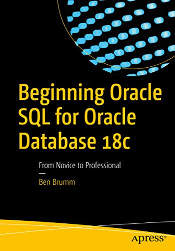

   <h1> Beginnint Oracle SQL for Oracle Database 18c </h1>
   
 <i> Ben Brumm </i> 

   

## Introduction
    - db-engines.com puts Oracle at #1 in popularity.
    - This book will help you get started with learning SQL on the latest version of Oracle's database: 18c.
    - databasestar.com: It offers practical advice for database developers.

## Chapter 1 - What is a database?
    - *A database is a defined structure of files and information that lets users and software store, retrieve, and update data in an efficient way.*
    - A database is not the only way to store data. Data can also be stored directly in files.
    - Indexes are another type of object on the database, and are used to make it easier to find data stored in tables.
        - It's an object that improves the efficiency of a query.

## Chapter 2 - Setting up
    - Oracle Express and Oracle SQL Developer.
    - LiveSQL (https://livesql.oracle.com) 
