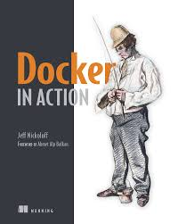

  <h1> Docker in Action </h1>
  
 <i> Jeff Nickoloff</i> 

 
   

## Commands
- Basic
    - *docker run*: Pull an image and automatically start a container.
    - *docker run -it*: Starts a container in interactive mode with an open TTY.
    - *docker run -it --rm*: Remove a container after stop it.

- Volumes
    - *docker run -d --volumes-from ... --name ... [image]*: Volume container. 
    - *docker run --name bmweb -v ~/example-docs:/usr/local/apache2/htdocs -p 80:80 httpd:latest*: Bind mount volumes.
    - *docker run --name bmweb_ro -v ~/example-docks:/usr/local/apache2/htdocs:ro -p 80:80 httpd:latest*: Read-only bind mount volumes.
      
### Chapter 1 - Welcome to Docker
### Chapter 2 - Running software in containers
### Chapter 3 - Software installation simplified
### Chapter 4 - Persistente storage and shared state with volumes
- *A volume is a mount point on the container's directory tree where a portion of the host directoyr tree has been mounted.*
    - Volumes provide container-independent data management
    - Images are appropriate for packaging and distributing relatively static files like programs; Volumes hold dynamic data or specializations.
- *Volume containers*: Advanced pattern.
- *Bind mount volumes*: A bind volume is a volume that points to a user-specified location on the host file system. I'ts useful if you want to share data with other processes running outside a container.
    - Read-only bind mount volumes: Prevent any process inside the container from modifying the content of the volume.
- *Docker-managed volumes*: Docker daemon creates managed volumes in a portion of the host's file system that's owned by Docker.
- *Sharing volumes*
    - - There are two ways to share volumes between containers: Host-dependent sharing (Different container shared the same mount point) and Generalized sharing.
- Cleaning up managed volumes is a manual task. This default functionality prevents accidental destruction of potentially valuable data.
    - A volume can be orphan (delete a container without the -v option). Removing orphaned volumes requires messy manual steps.
    - I'ts a better idea to avoid the situation by getting nto the habit of using the -v option and uing the volume container pattern.
    - Orphan volumes render disk space unusable until you've cleaned them up.

### Chapter 5 - Network exposure
- Docker creates a virtual network that connects all of the running containers to the network that the computer is connected to. That network is called a *bridge*.
- Docker is concerned with two types of networking: single-host virtual network and multi-host networks.
    - *Local virtual networks*: I's used to provide container isolation.
    - *Multi-host virtual networks*: It provides an overlay where any container on a participating host can have its own routable IP address from any other container in the network.
- Docker bridge interface is called *docker0*.
- Container (Own IP Address) --> Container virtual interface --> docker0 interface --> Logical host interface --> Physical network interface.
- Four archtypes for network containers: Defines how a container interacts with other local containers and the host's network.
    - **Closed**: It doesn't allow any network traffic. It does not have a connection to the Docker bridge interface.
    - **Bridged**: It's the most customizable and should be hardened as a best practice. It's the most common network container archetype.
        - '--hostname' flag adds an entry to the DNS override system inside the container.
        - Bridged containers are not accessible from the host network by default. Containers are protected by your host's firewall system.
        - Inter-container communication. Disallow Docker daemon network connections between containers is a best practice in multi-tenant environments. It minimizes the points (attack surface).
        - To disallow inter-container communication: *docker -d --icc=false ...*
        - Inter-container communication should be explicit.
    - **Joined**: These containers share a common network stack.
        - There's no isolation between joined containers.
        - You might use this pattern when two different programs with access to two different pieces of data need to communicate but shouldn't share direct access to the other's data.
        - If one process needs to communicate with another on an unexposed port, the best thing to do may be to join the containers.
    - **Open**: Open containers have full access to the host's network and no network container.
        - It's the most dangerous. 
- Links: One-way network dependencies created when one container is created and specifies a link to another.
    - '--link' flag takes a single argument. That argument is a map from a container name or ID to an alias.
    - A link will add connection information to a new container. This information is injected in the new container by adding environment variables and a host name mapping in the DNS override system.
    - Directional, static, and nontransitive (Linked containers won't inherit links).
    - Links can only be built from new containers to existing containers.

### Chapter 6 - Limiting risk with isolation
- Three flags on the *docker run* and *docker create* commands for managing three different types of resource allowances: Memory, CPU, and devoces.
    - Command example: *docker run -d --name ch6_mariadb --memory 256mb --cpu-shares 1024 --user nobody --cap-drop all dockerfile/mariadb*
    - **Memory Limits**: It restrict the amount of memory that processes inside a container can use.
        - *-m* or *--memory* flag
        - Protection against overconsumption.
    - **CPU**: You can specify the relative weight of a container.
        - *--cpu-shares* flag.
    - **Shared Memory**: It's often used when latency associated with network or pipe-based IPC drags software performance down below requirements. 
        - The '--ipc' flag has a container mode that will create a new container in the same IPC namespace as another target container.
- Docker starts containers as the root user inside that container by default.
    - The following command can get a list of available users in an image:
        - '*docker run --rm busybox:latest awk -F: '$0=$1' /etc/passwd*'  
    - The 'nobody' user is very common and intended for use in restricted-privileges scenarios like running applications.
- Tools to increase containers security: *AppArmor* and *SELinux*.

### Chapter 7 - Packaging Software for Distribution
- How to originate, customize, and specialize the images.
- The basic workflow for building an image from a container includes three steps:
    - Create a container from an existing image.
    - Modify the file system of the container.
    - Commit those changes.
    - Example:
        - *docker run --name hw_container ubuntu:latest touch /HelloWorld*
        - *docker commit hw_container hw_image*
        - *docker rm -vf hw_container*
        - *docker run --rm hw_image ls -l /HelloWorld*
- An entrypoint is the program that will be executed when the fcontainer starts. If the entrypoint isn't set, the default command will be executed directly.
    - '--entrypoint' flag.
- It's important to know the relationship between layers and how layers relate to images, repositories and tags.
- A union files system (UFS) is made up of layers. Each time a change is made to a union file system, that change is recorded on a new layer on top of all of the others.
- Images are stacks of layers constructed by traversing the layer dependency graph from some starting layer.
    - A layers's ID is also the ID of the image that it and its dependencies form.
    - All layers below the writable layer created for a container are immutable.
- Repository is roughly defined as a named bucket of images. More specifically, it's a location/name pair that point to a set of specific layer identifiers.
- Automating image builds with Dockerfile is a better idea.

### Chapter 8 - Build automation and advanced image considerations
