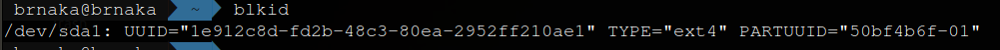

<div align="center">
  <h1> How Linux Works - What every superuser should Know  </h1>
  <p> <i> Brian Ward, 2nd Edition </i> </p>
</div>

<div align='center'> 
   
</div>

### Chapter 1 - The Big Picture
- Abstraction
- Linux is divided in 3 levels: Hardware, Kernel and Application (Processes).
- Image: Particular physical arrangement of bits in memory.
- The Kernel is in charge with four general system areas: 
    1. Determine which process will use the CPU (Context Switch and Multitasking Concept) 
    2. Track and manage memory allocation to processes or between them (MMU - Memory Management Unit; Memory Address Map is called a Page Table) 
    3. Be the interface between processes and hardware 
    4. Support syscalls from processes.
- Kernel does not manage usernames. Instead, it manages userids. A user may terminate or modify the behavior of its own processes (within certain limits), but it cannot interfere with other users’ processes. 
- Linux Directory Hierarchy:
  1. **“/bin”**: Executables or shell scripts
  2. **“/dev”**: Device files
  3. **“/etc”**: Contains setup files (network, password, boot). Many are specific to machine’s hardware.
  4. **“/home”**: Personal Directories
  5. **“/lib”**: Libraries that executables can use. There  are two types of libs: statics and shared. In the root path, there is just shared libs. 
  6. **“/proc”**: Contains information about current processes as well as some kernel parameters.
  7. **“/sys”**: Provides a device and system interface.
  8. **“/sbin”**: System executables related to system management.
  9. **“/tmp”**: A storage area for smaller, temporary files that you don’t care much about.
  10. **“/usr”**: Despite the name, there are no user files. It contains a large directory hierarchy, including the bulk of the Linux System.
  11. **“/var”**: The variable subdirectory, where programs record runtime information.
  12. **“/boot”**: Contain kernel boot loader files (Only the very first stage of the Linux startup procedure)
  13. **“/media”**: A base attachment point for removable media such as flash drives.
  14. **“/opt”**: This may contain third-party softwares.
  
### Chapter 3 - Devices
- How the kernel sends a message to a user-space process through udev.
- Device files = Device nodes
H- ow to identify a device file? Look in the file permissions. If started with ‘b’ (block), ‘c’ (character), ‘p’ (pipe) or ‘s’ (socket), you’re dealing with a device file.
- A device may have a different name between reboots, because the kernel assigns devices in order which they are found.
- ‘/dev’: User processes can use the device.
- ‘/sys/devices’: View information and manage the device.
- Why hard drives in Linux receives the prefix name convention of ‘sd’? ‘sd’ stands for SCSI disk (Small Computer System Interface).
- Conventions:
  1. ‘sd’: Hard Disks
  2. ‘sr’: DVD/CD Drives
  3. ‘hd’: Common on older versions of the Linux kernel and with older hardware.
- ‘dev/tty1’ (the first virtual console); ‘dev/pts/0’ (the first pseudoterminal device).
- Audio devices: ‘/dev/snd/*’, ‘/dev/dsp’, ‘/dev/audio’...
- The Linux Kernel can send notifications to a user-space process (called udevd) upon detecting a new device on the system. udevd adds a symbolic link for the incoming device.

### Chapter 4 - Disks and Filesystems
- To access data, Linux uses the system of layers.
- MBR (Master Boot Record): Traditional Table. Limited by four primary partitions. Extended partitions can be subdivided into Logical Partitions.
- GPT (Global Unique Identifier Partition Table)
- FUSE (File System in User Space) allows user-space filesystems in user-space.
- Filesystems Types:
  1. ext4 (Fourth Extended Filesystem)
  2. ISO9660
  3. FAT (msdos, vfat, umsdos): Microsoft systems.
  4. HFS+ (hfsplus): Macintosh systems.
- Mounting: the process of attaching a filesystem. In order to mount a filesystem, you must know the following (“Mount a device on a mount point”)
  - The filesystem device.
  - The filesystem type.
  - The mount point.
- Filesystems UUID (Universal Unique Identifier) - Command ‘blkid’ shows uuid.

<div align='center'> 
   
</div>

- “/etc/fstab” Filesystem Table: 

<div align='center'> 
   
</div>

- Filesystem checks are performed with the command ‘fsck’
- _“You should never use fsck on a mounted filesystem because the kernel may alter the disk data as you run the check, causing runtime mismatches that can crash your system and corrupt files. There is only one exception: If you mount the root partition read-only in single-user mode, you may use fsck on it.”_

### Chapter 5 - How the Linux Kernel Boots
- 7 steps:
  1) BIOS runs a boot loader.
  2) Boot loader finds kernel image on disk, loads it into memory and starts it.
  3) Devices and drivers initialization.
  4) Filesystem is mounted.
  5) Init process with ID 1 is started (user space start point)
  6) Init sets the rest of the system processes in motion
  7) Init starts a process that allow the user to log in. 	
- Two ways to view kernel’s boot and runtime diagnostic logs:
  - In “/var/log/kern.log” or in “/var/log/messages”.

<div align='center'> 
   
</div>

  - Using the “dmesg” command piped with less command (‘dmesg | less’)

<div align='center'> 
   
</div>

- Kernel initialization steps:
  1) CPU inspection
  2) Memory inspection
  3) Device bus discovery
  4) Device disocovery
  5) Auxiliary kernel subsystem setup (networking and so on)
  6) Root filesystem
  7) User space start
- Kernel parameters: Specify different types of behavior, such as the amount of diagnostic output the kernel should produce and device driver-specific options (How to see these parameters? “cat /proc/cmdline”)

<div align='center'> 
   
</div>

  - ‘ro’: Instructs the Kernel to mount the filesystem in read-only upon user space start.
  - ‘splash’: Enable a splash screen.
- **Boot Loader**: It finds where the Kernel is located, load the Kernel into memory and starts it with parameters. ‘Chicken and egg’ problem. Boot loaders uses the BIOS (Basic Input/Output System) or UEFI (Unified Extensible Firmware Interface) to access hard disks and find the Kernel and its parameters. (GRUB (Grand Unified Boot Loader), LILO, SYSLINUX, LOADLIN, efilinux, coreboot, Linux Kernel EFISTUB).
  - GRUB has its own device-addressing scheme.
  - To access the GRUB Menu hold SHIFT on BIOS screen.
  - Press ‘esc’ to ignore timeout and ‘c’ to enter in the GRUB command line.
  
<div align='center'> 
   
</div>
<br>
<div align='center'> 
   
</div>
<br>
<div align='center'> 
   
</div>
<br>
<div align='center'> 
   
</div>
<br>
<div align='center'> 
   
</div>
<br>
<div align='center'> 
   
</div>
<br>

- Don’t edit “grub.cfg” file directly, because system generate and occasionally overrides it. 
- “grub-mkconfig”: Runs everything in ‘/etc/grub.d’.
- UEFI secure boot: This mechanism requires boot loaders to be digitally signed by a trusted authority in order to run.
- Two main schemes to boot: MBR and UEFI.
    - MBR Boot:  Small area (441 bytes) that the PC BIOS loads and executes after its Power-On Self-Test (POST). Multi-stage boot loader (when the storage space is too small). This scheme won’t work with GPT-partitioned disk, because it resides in the area after the MBR.
    - UEFI Boot: Rather than executable boot code residing outside of a filesystem, there is always a special filesystem called the EFI System Partition (ESP), which contain a directory name called efi.
    
### Chapter 6 - How user space starts
- User space starts in this order generally:
    1) init process starts (start and stop the essential processes on the system)
Three implementations: sys-V, systemd, Upstart.
    2) Essential low-level services such as udevd and syslogd.
    3) Network configuration.
    4) Mid- and high-level services (cron, printing, and so on).
    5) Login prompts, GUIs, and other high-level applications.
- “systemctl”: Allow the user to interact with the systemd. It allows you to activate and deactivate services, list status, reload the configuration, and much more.
- “systemctl list-units” outputs all active units

<br>
<div align='center'> 
   
</div>
<br>

- Log of a particular service can be viewed with: “journalctl _SYSTEMD_UNIT=<service>” 
- initramfs (Initial RAM filesystem)
  
### Chapter 7 - System Configuration: Logging, System, Time, Batch, Jobs and Users
- “/etc” directory - Configuration files are placed in this location. Customizable configurations for a single machine.
- Most system programs write their diagnostic output to the  “syslog” service;
- Many files in ‘/var/log’ aren’t maintained by the system logger.
- “rsyslogd” (Reliable and Extended Syslogd).
- At the Kernel level, users are simple numbers (user IDs)
- The “/etc/passwd” maps usernames with user IDs (each line represents a user, with 7 fields separated by a ‘:’

<div align='center'> 
   
</div>

 1. The username (login name)
 1. Encrypted password. Most Linux systems stores the password in the shadow file and it’s never in plain text. The ‘x’ in the second field indicates that the password is stored in the “/etc/shadow” file.
 1. The user id (UID). 
 1. The group id (GID).
 1. The user’s real name.
 1. The user’s home directory
 1. The user’s shell.
- ‘passwd user’, ‘adduser’, ‘userdel’ to change, insert and delete user passwords.
- The kernel system clock represents the current time as the number of seconds since 12:00 midnight on January 1, 1970, UTC. 
- Effective User Id (the actor), Real User Id (ruid) indicates who initiated the process (the owner).
- PAM (Pluggable Authentication Modules) - A system of shared libraries for authentication.

### Chapter 8 - A Closer Look At Processes and Resource Utilization
- Three basic kinds of hardware resources: CPU, memory and I/O.
- atop, htop and top commands: It displays processes information like memory usage, CPU usage. 
- lsof: list open files and the processes using them.
- strace: Tracks system calls.
- ltrace: Tracks shared library calls.
- Virtual Memory -> MMU (Memory Management Unity) -> Physical Memory
    - The map is stored in data structures called Page Table.
    - Page fault: When a process wants to use a page, but it’s not ready (Minor and Major Page faults).
    
### Chapter 9 - Understanding your Network and its Configuration
- Functioning Network includes a full set of network layers called a network stack:
    - Application Layer: Hypertext-Transfer Protocol (HTTP), Secure Socket Layer (SSL) and FTP (File Transfer Protocol)
    - Transport Layer: Data integrity checking, source and destination ports. Transmission Control Protocol (TCP) and User Datagram Protocol (UDP).
    - Network Layer: How to move packets from a source host to a destination host. Internet Protocol (IP), IPv6, IPX and AppleTalk.
    - Physical Layer: How to send raw data. Ethernet or modem.
- Another term for router is Gateway.
- Subnet Mask: Defines the subnet that an IP address belongs to.
  - To define a subnet: Network prefix + Subnet Mask.
  - Classless Inter-Domain Routing (CIDR): ‘10.23.2.0/255.255.255.0’ -> ‘10.23.2.0/24’. 24 is the number of 1s that compose the subnet mask. Example: ‘255.255.255.0’ in binary is equal to ‘11111111.1111111.1111111.0000000’ = 24 1’s.
- Routing Table
- Default Gateway: Where you send messages when there is no other choice.
- ICMP: Internet Control Message Protocol (It can help you root out problems with connectivity and routing. 
    - “If there’s no way to reach the destination, the final router to see the packet returns an ICMP ‘host unreachable’ packet to ping”.
- Devices on Ethernet send messages in frames, which are wrappers around the data sent. The frame contains the origin and destination MAC address.
- Network Interface: Link the IP address settings from the Internet side with the hardware identification in the physical side.
- Network Manager: daemon that the system starts upon boot.
- Resolution process of resolving hostnames (most simplified): 
    1) Function in shared libraries is called to lookup for IP’s behind the hostname. 
    2) The function follows some rules find in ‘/etc/nsswitch.conf’ file.
    
<div align='center'> 
   
</div>

  - This rules determines a plan of action on lookups (e.g ‘Even before going to DNS, check for manual override in ‘/etc/hosts’ file).

<div align='center'> 
   
</div>


 3) The function tries to find a DNS server IP address. 
 4) The function sends a request to the DNS server.
 5) The DNS server replies with the IP address for the hostname.
- ‘/etc/resolv.conf’: Traditional configuration file for DNS server.
- Local machines does not cache DNS servers replies. To solve this problem, many machines run a daemon that intercept name server request and returns a cached answer. If there is no cache, requests go to real DNS servers.
- The Transport Layer: TCP and UDP
  - “netstat -nt”: shows connections currently open on your machine.
  - Establishing TCP connections
  - “/etc/services”: Lists well-known ports
  - The hard part of TCP is knowing how to convert a series of incoming packets into an input data stream for processes to read (packets may not arrive in order). This protocol also needs to check for errors or packages lost during the communication
- Dynamic Host Configuration Protocol (DHCP):Network configuration is set automatically (IP address, NetMasks, DNS servers and Gateway). The router usually acts as the DHCP server.
- Routers are essentially just computers with more than one physical network interface.
- Private Networks: Not all IP addresses are visible to the whole internet. To connect private networks to the internet, the router must setup a Network Address Translation (NAT). On linux, this is called IP masquerading. 
- A firewall is a software and/or hardware configuration that usually sits on a router between the Internet and a smaller network.
    - In Linux, you create firewall rules in a series known as a chain. A set of chains make up a table (iptables and nftables). 
    - Two basic kinds of firewall scenarios: Individual machines (set rules to machine’s INPUT chain) and Network (set rules in the FORWARD chain).
- Address Resolution Protocol (ARP): Automatic system of looking up MAC addresses
    - ARP cache maps IP addresses to MAC addresses (command ‘arp -n’)
- You should’t use WEP if you’re serious about security.

### Chapter 10 - Network Applications and Services
- *TCP services* are built upon simple, uninterrupted two-way data streams.
- Some network servers: *httpd, apache, apache2, sshd (secure shell daemon), postifx, qmail, sendmail, cupsd, nfsd, mountsd*.
- *SSH server*: Standard for remote access to a UNIX machine. *OpenSSH* is a popular free SSH implementation.
  1) Encrypts passwords and all session data.
  2) Tunnels other network connections (*Tunneling is the process of packaging and transporting one network connection using another one*).
  3) Offer clients for nearly any operating system.
  4) Uses keys for host authentication.
- *sshd* server needs configuration -> *'/etc/ssh'* directory
- *SSH version 1* has RSA keys and *SSH version 2* has RSA and DSA keys.
- *TCP wrappers*: Host control over the network services.
- *Wireshark*: GUI for *'tcpdump'* command.
- *Nmap* (The Network Mapper): Scan ports. *If someone else controls the network that you want to scan with Nmap, ask for permission. Network admnistrators watch for port scans and usually disable access to machines that run them*.
- Tips to system security:
  - *Run as few services as possible*
  - *Block as much as possible with firewall*
  - *Track the services that you offer to the Internet*
  - *Use 'long-term support' distribution releases for servers*
  - *Don't give an account on your system to anyone who doesn't need one*
  - *Avoid to install dubious binary packages*
- Two types of vulnerabilities: *Direct attacks* and *clear-text password sniffing*
- Security websites:
  - http://www.sans.org/
  - http://www.cert.org/
  - http://www.insecure.org/
- A process uses a *socket* to identify when and how it's talking to the network. *Sockets* are the interface that processes use to access the network through the kernel. It's also used to process inter-communication (IPC).
- *Books*:
    - *Applied Cryptography: Protocols, Algorithms, and Source Code in C, 2nd edition by Bruce Schneier (Wiley, 1996)*
    - *SSH Mastery: OpenSSH, PuTTY, Tunnels and Keys by Michael W. Lucas (Tilted Windmill Press, 2012)*
    - *SSH, The Secure Shell, 2nd edition, by Daniel J. Barrett, Richard E. Silverman, and Robert G. Byrnes(O’Reilly, 2005)*
    - *Implementing SSL/TLS Using Cryptography and PKI (Wiley, 2011)*
    - *Unix Network Programming, Volume 1, 3rd edition, by W. Richard Stephens, Bill Fenner, and Andrew M. Rudoff (Addison-Wesley Professional, 2003)*
    
### Chapter 11 - Introduction to Shell Script
- Shell scripts are useful to automate tasks. 
- Quotes and Literals:
```shell
  # Double Quotes (prints: 00)
  echo "$100"
    
  # Single Quotes - Literals (prints: $100)
  echo '$100'
```
-Special Bourne shell variables:
```shell
  # Individual arguments: $1 $2 $3
  echo First Argument: $1
  echo Third Argument: $3
  
  # Print the number of arguments
  echo $#
  
  # All arguments: $@
  gs -q -dBATCH -dNOPAUSE -dSAFER -sOutputFile- -sDEVICE=pnmraw $@
  
  # Print script name
  echo $0
  
  # Print shell pid
  echo $$
  
  # Print the last process exit code
  echo $?
```
- Conditionals (*if/then/else, case*):
  - Understanding the exit codes:
    1) *The shell runs the command after the if keyword and collects the exit code of that command.*
    2) *If the exit code is 0, the shell executes the commands that follow the then keyword, stopping when it reaches an else or fi keyword*
    3) *If the exit code is not 0 and there is an else clause, the shell runs the commands after the else keyword*
    4) *The conditional ends at fi*
  - The stuff following '*if*' is always a command ('[]' is a symlink to the *test* command) 
```shell
#!/bin/sh
if [ "$1" = hi ]; then
  echo 'The first argument was "hi"'
else
  echo -n 'The first argument was not "hi" --'
  echo It was '"'$1'"'
fi
```
- && and || Logical Contructs
```shell
  # If the command1 returns an exit code equal to 0, then command2 is executed
  command1 && command2
  
  # If the command1 return an exit code different than 0, then command2 is executed
  command1 || command2
```
- Testing Conditionals:
```shell
  # -f tests if the argument is a regular file and not a directory or special file
  if [ -f file ]; then 
    echo "Regular file"
  fi
```
- Two kinds of loops in Bourne shell: *for* and *while*:
  - *for* loop
  ```shell
  #!/bin/sh
  for str in one two three; do
    echo $str
  done
  ```
- 'cat <<EOF': Redirect all lines that follow the standard input to cat. 
- Important Shell Scripts Utilities:
  - *basename*: Strip the extension from a filename or get rid of the directories in a full pathname
  - *awk*: It's a programming language. 
  ```shell
    #!/bin/sh
    
    # Return a list o file sizes (prints the fifth field of ls output)
    ls -l | awk '{print $5}'
  ```
  - *sed (stream editor)*
  - *xargs*: When you have to run one command to a huge number of files (Alternative is the *-exec* option of *find*).
  - *expr*: Arithmetic operation (It's slow)
  - *exec*: The exec command is a built-in shell feature that replaces the current shell process with the program you name after exec.
  
### Chapter 12 - Moving files across the Network
