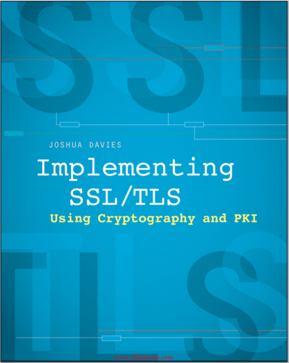

  <h1> Implementing SSL/TLS using Cryptography and PKI  </h1>
  
 <i> Joshua Davies </i> 

 
   

### Introduction
- *This book should help you understand the internals of libraries like OpenSSL, GnuTLS and NSS*
- *C code examples*
- *Requests for Comments (RFCs)* are maintained by *Internet Engineering Task Force (IETF)*. *RFCs* documents protocols related to the internet.
- *My primary motivation in writing this book was to present, in detail, the interplay between the SSL and TLS protocols and the cryptographic routines thet they rely on.*

### Chapter 1 - Understanding Internet Security
- Standard encryption algorithms: *RSA* and *DSA*.
- *Man in the middle, side-channel, and timing attacks* -> aim to compromise privacy and security.
- *Internet Protocol (IP)*: Outlined in *RFC 971* (How packetization happens and how adresses are attached to packet headers?).
- Packets: *Origin Host -> Packet Data+Destination IP Address -> Router -> ... -> Destination Host*
- *DNS spoof*: Forwarding traffic that's meant for one destination to another.
  - *traceroute* command: Maps the journey that a packet of information undertakes from its source to its destination.
- *Socket*: Connection between a sender and a receiver. A socket refers to an established TCP connection.
- *TCP handshake* (described in *RFC 793*): 
  1) Client sends SYN (synchronize) packet to the server.
  2) Server responds with SYN/ACK (aknowledgment) packet.
  3) Client sends back a ACK packet.
  4) Connection is established (ports on client and server are attached to header).
  5) After that, client and server have a *socket*.  
- *SSL (Secure Socket Layer)*: Performs a secod handshake between client and server to establish a secure channel over the inherently insecure TCP layer.
- *HTTP Protocol*: 
  - Described in *RFC 2616*.
  - Browsers, the client, establish sockets with servers on port 80.
  - Each request demands a new socket.
  - *HTTPS* = HTTP + SSL.
  - It's case sensitive.
  - To request a document, the client needs to establish a socket with the server. *What does it means?* It means that the client needs to create a *SYN* package and send it to the server. The server needs to respond with a *SYN/ACK* package and, finally, the client concludes the handshake sending back an *ACK* package. When the server is not accessible, the client can use a *proxy-server* to funnel its requests to the target server. (*client -> proxy-server -> server*).
  - The standard format for a *Proxy*: 'http://[username:password@]hostname[:port]/'
- *Base64 Encoding*: Map binary into the range of printable ASCII characters.
  - Divides the input into 6-bit chunks (2^6 = 64, so *base64*) and maps each chunk into one of the printable ASCII characters.
  - First 52 combinations ('A-Za-z'); 10 combinations ('0-9'); and last 2 ('+/').
  - Complexity deals with non-aligned input ('=' is added to ensure alignment).
  - Output is 1/3 bigger than input.
  - Base64 it's required by the specification. 

