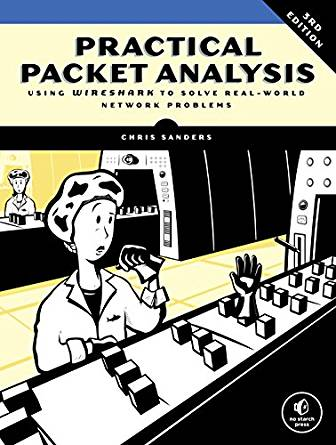
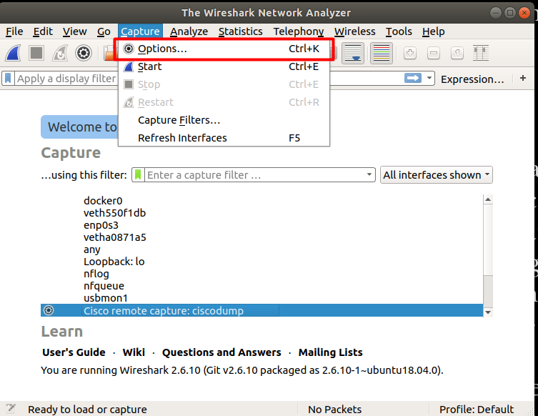
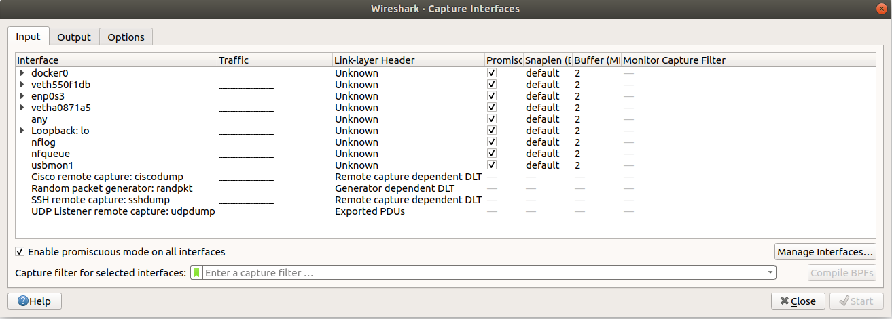
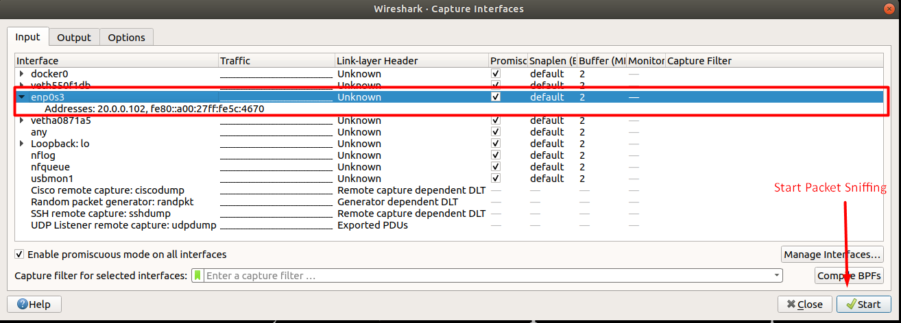
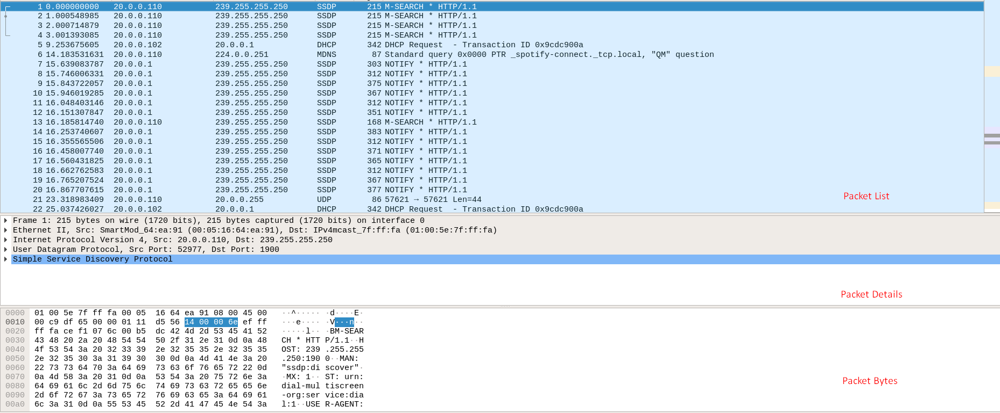

   <h1> Practical Packet Analysis, 3rd Edition </h1>
   
 <i> Chris Sanders </i> 

   

## Introduction
- *The first half of this book gives you the knowledge you'll need to understand packet analysis and Wireshark. The second half of the book is devoted entirely to practical cases that you could easily encounter in day-to-day network management*.

## Chapter 1 - Packet Analysis and Network Basics
- The more we can do at the packet level, the more we can control our network and solve problems.
- *Packet Analysis*: Describes the process of capturing and interpreting live data as it flows across a network in order to better understand what is happening on that network. It can help with:
    - *Understanding network characteristics*
    - *Learning who is on a network*
    - *Determining who or what is utilizing available bandwidth*
    - *Identifying peak network usage times*
    - *Identifying malicious activity*
    - *Finding unsecured and bloated applications*
- *Packet Sniffers*: Wireshark, tcpdump...
    - How do they work?
        - Cooperative effort between software and hardware.
        1) *Collection*: Switch the network interface into *promiscuous mode*. The packet sniffer collects raw binary data from the wire.
        2) *Conversion*: Raw binary data is converted into a readable form. 
        3) *Analysis*: Packet sniffer conducts an analysis of the captured and converted data. It verifies the protocol of the captured network data. 

## Chapter 2 - Tapping into the wire
- A key decision for effective packet analysis is where to physically position a packet-sniffer to appropriately capture the data.
- Sniffing packets on a network requires a Network Interface Card (NIC) that supports a promiscuous mode driver (Allow a NIC to view all packets crossing the wire).
    - When operating in promiscuous mode, the NIC passes the packet it sees to the host's processor, regardless of addressing. Once the packet makes it to the CPU, a packet-sniffing application can grab it for analysis. 
    - *wireshark* libpcap/WinPcap driver: Switch your NIC directly into promiscuous mode.
- Ways to capture traffic from a switched network:
    1) *Port mirroring or Port spanning*: Forces the switch to copy all traffic on one port to another port. Downside: It's not reliable enough.
    2) *Hubbing out*: Place the target device and your analyzer system on the same network segment by pluggin them both directly into a hub. Downside: You need physial access to the switch. Hubs are antiquated.
    3) *Using a tap*: A tap is a hardware device that you can place between two points on your cabling system to capture the packets between those two points. Plaing tap between the switch and the router allow us monitoring entire network (commonly used in security monitoring).
    4) *ARP caching poisoning or ARP spoofing*: Transmitting computer sends an ARP request to the data link layer broadcast address ff:ff:ff:ff:ff:ff. The packet basically asks: *"Which IP address owns the xx:xx:xx:xx:xx:xx MAC address?"*. It's an Advanced form of tapping. It works by sending ARP messages to an Ethernet switch or router with fake MAC addresses in order to intercept the traffic of another computer. It only works on Local Area Networks that uses ARP for IP address resolution.
- A network map, or network diagram, shows all technical resources on a network and how they are connected.

## Chapter 3 - Introduction to Wireshark
- Creator: Gerald Combs, a computer science graduate of the University of Missouri at Kansas City.
- Wireshark supports more than 1000 protocols.
- Wireshar installation on Ubuntu: *sudo apt-get install wireshark wireshark-qt*
- To find anomalies in daily network activity, you must know what normal daily network activity looks like. 
- Wireshark main panel:
    - *Packet List*: Displays table containing all packets in the current capture file. 
    - *Packet Details*: Hierarchical display of information about a single packet and can be collapsed or expanded to show all about a single packet and can be collapsed or expanded to show all of the information collected about the individual packet.
    - *Packet Bytes*: Packets in its Raw

 
   

 
   

 
   

 
   

## Chapter 4 - Working with Captured Packets
- The flags of a TCP packet are located at offset 13.
- The success or failure of your analysis depends on your ability to create filters appropriate for your current situation.

## Chapter 5 - Advanced Wireshark filters
- *Endpoint*: Each device sending and receiving data on the network.
- *Conversation*: Communication between two endpoints.
    - Data Link Conversation Level: Endpoint A (MAC: 00:ff:ac:ce:0b:de) <========================> Endpoint B (MAC: 00:ff:ac:e0:dc:0f)
    - Network Conversation Level  : Endpoint A (IP: 192.168.1.25) <==============================> Endpoint B (IP: 192.168.1.30) 
- **Statistics > Endpoints**: show statics to Enpoints
- **Statistics > Conversations**: show statics to Conversations 
- The Endpoints and Conversations windows are helpful in network troubleshooting, especially when you're trying to locate the source of a significat amount of traffic on the network. 
- *Protocol Dissectors*: Allow Wireshark to recognize and decode a protocol into various fields so the protocol can be displayed in the user interface.

## Chapter 6 - Packet Analysis on Then Command Line
- Command line tools for packet analysis: *TShark* for Windows users and *tcpdump* for linux users.
- *Tcpdump*: The most popular command line packet analysis application.

## Chapter 7 - Network Layer Protocols
- Workhorses of network communitcation: ARP, IPv4, Ipv6, ICMP, and ICMPv6.
- *Address Resolution Protocol (ARP)*
    - Logical Addresses: Allow for communication among multiple networks and indirectly connected devices.
    - Physical Addresses: Facilitate communication on a single network segment for devices that are directly connected to each other with a switch.
    - Switch that interconnects devices on a network uses a *Content Addressable Memory (CAM) table*: Lists the MAC addresses of all devices plugged into each of its ports.
    - *ARP protocol*: Resolve an IP address to a MAC address.
        - Two packets: ARP request and ARP response.
        - ARP request: "Howdy, everybody. My IP address is 192.168.0.101, and my MAC addresss is f2:f2:f2:f2:f2:f2. I need to send something to whoever has the IP address 192.168.0.1, but I don't know the hardware address. Will whoever has this IP adress please respond with your MAC address?"
        - ARP response: MAC address is sent to the requester.
        - Gratuitous ARP: Device's IP address can change. Gratuitous ARP packet is transmitted on the network to force any device that receives it to update its cache with the new IP-to-MAC address mapping. Changing a device's IP address will generate a gratuitous packet.
- *Internet Protocol (IP)*: Ipv4 is the workhorse of the communication process and is ultimately responsible for carrying data between devices, regardlesss of where the communication endpoints are located.
    - Complex networks can consist of thousands of LANs connected through thousands of routers worldwide. The internet itself is a collections of millions of LANs and routers.
    - *Network mask* (netmask): Determines the network portion and the host portion (ex: netmask 255.255.255.0. First 3 bytes determines the network and the last byte identify the host on the network).
    - *Class Inter-Domain Routing (CIDR)* notation: 192.168.1.2 whose netmask is 255.255.255.0 can be writen as 192.168.1.2/24.
    - *Time to Live*: The TTL value defines a period of time that can elapse or a maximum number of routers a packet can traverse before the packet is discarded for IPv4.
    - *IP Fragmentation*: It's a feature of IP that permits reliable delivery of data across varying types of networks by splitting a data stream into smaller framents. It's based on *MTU* (Maximum transmission unit) size. Ethernet has a default MTU of 1500, which means that the maximum packet size that can be transmitted over an Ehernet network is 1500 bytes.
- *Internet Protocol Version 6 (IPv6)*
    - It's written in eight groups of 2 bytes in hexadecimal notation. (ex: 1111:aaaa:2222:bbbb:3333:cccc:4444:dddd)
    - IPv6 adddress has a network portion and a host portion (*network prefix* and *interface identifier*).
    - This protocol provides a lot more efficiently than IPv4 in terms of routing packets to their destination and making effective use of address space.
    - NDP (Neighbor Discovery Protocol): Neighbor solicitation.     
    - Multicast communication: Only hosts that subscribe to a data stream will receive and process data.
    - IPv6 addresses a very real problem, but its adoption has been slow because of the effort required to transition network infrastructure to it.
- *Internet Control Message Protocol (ICMP)*: It's the utility protocol of TCP/IP.
    - It's responsible for providing information regarding the availability of devices, srevices, or routers on a TCP/IP network.
    - Ping command uses ICMP to check if a device is reachable. Many of today's firewalls limit the ability of a device to respond to ICMP packets.

## Chapter 8 - Transport Layer Protocols
- *Transport Control Protocol (TCP)*: The goal is to provide end-to-end reliability for the delivery of data.
    - It handles data sequencing and error recovery.
    - TCP header fields:
        1) **Source Port**: The port used to transmit the packet
        2) **Destination Port**: The port to which the packet will be transmitted
        3) **Sequence Number**: The number used to identify a TCP segment. This field is used to ensure that parts of a data stream are not missing.
        4) **Acknowledgement Number**: The sequence number that is to be expected in the next packet from the other device taking part in the communication.
        5) **Flags**: The URG, ACK, PSH, RST, SYN, and FIN flags for identifying the type of TCP packet being transmitted.
        6) **Window Size**: The size of the TCP receiver buffer in bytes
        7) **Checksum**: Used to ensure the contents of the TCP header and data are intact upon arrival
        8) **Urgent Pointer**: If the URG flag is set, this field is examined for additional instructions for where the CPU should begin reading the data within the packet.
        9) **Options**: Various optional fields that can be specified in a TCP packet.
    - There are 65.535 ports available divided in two groups:
        - *System port group*: 1 - 1023 (well-know established services)
        - *Ephemeral port group*: 1024 - 65535 (Source ports are chosen at random by the OS)
    - Only one service can communicate on a port at any given time.
    - HTTP uses TCP for communication
    - *TCP Three-Way Handshake*: Host can be sure if the recipient is able to communicate and receive data.
        1) Host A sends a TCP packet with a SYN flag + no data + initial sequence number  + MSS (Maximum segment size)
        2) Host B sends back a packet with SYN/ACK Flag + initial sequence number
        3) Host A sends back a packet with ACK Flag
        - SYN --> SYN/ACK --> ACK
    - *TCP teardown*: It's used to gracefully end a connection between two devices after they have finished communicating. It involves four packets:
        1) Host A sends a FIN/ACK packet to Host B.
        2) Host B receives the packet and sends back an ACK packet 
        3) Host B also sends a FIN/ACK packet.
        3) Finally, HOST A receives the packet and sends back an ACK packet to Host B ending the communication
    - *TCP resets*: Occurs when the communication is ended abruptally or is denied by the receiver host.
        - The receiver host sends a RST/ACK packet indicating that the communication is not established anymore.
- *User Datagram Protocol (UPD)*: Speedy transmission but not reliable.
    - Connectionless protocol: It does not formally establish and terminate a connection between hosts unlike TCP.
    - DNS and DHCP protocols relies on UDP.
- TCP and UDP are at the core of most of your daily communication, and the ability to analyze them effectively is critical to becoming an effective packet analyst.

## Chapter 9 - Common Upper-Layer Protocols
- *Dynamic Host Configuration Protocol (DHCP)*: Automatically assigns an address to a network-connected device.
    - Initially BOOTP --> DHCP
    - DHCP initialization process:
        - It's referred to as the DORA process.
        - Four DHCP packets: discover, offer, request, and acknowledgment.
- *Domain Name System*: Map names to IP addresses
    - *DNS Recursion*: DNS servers must be able to communicate with each other in order to answer the queries submitted by clients.
        - *recursion*: A DNS server queries another DNS server on behalf of the client making the request.
    - *DNS Zone Transfers*: Namespace (or group of DNS names) that a DNS server has been delegated to manage.
- *Hyper-Text Transfer Protocol (HTTP)*
- *Simple Mail Trasnfer Protocol (SMTP)* 

## Chapter 10 - Basic Real-World Scenarios
- Filter HTTP requests by method: *http.request.method == "GET"* 
    - Or, *Statistics > HTTP > Requests*
- Protocol Hierarchy: Allow us to spot unexpected protocols or peculiar distributions of traffic per protocol.
- An individual web page may provide content hosted on multiple servers.
- DNS-to-IP address mappings can result in problems.
- Internet access is handled through a single router serving as the default gateway (IP-addressing information is provided by DHCP.
- A TCP retransmission packet is sent when one device sends a TCP packet to a remote device and the remote device doesn't acknowledge the transmission. Once a retransmission treshold is reached, the sending device assumes that the remote device did not receive the data, and it retransmists the packet.
- DNS usually yses UDP, but it uses TCP when the response to a query exceeds a certain size.
- FTP STOR command: It's used to upload data to an FTP server.(*ftp.request.command == "STOR"*)
- *The programmer was concerned about all of the mysterious components their application was dependent upon, but at the end of the day, their compicated data transfer that took hundreds of lines of code is still no more than FTP, TCP, and IP. It's crucial to remember that no matter how comples the issue at hand, it sill comes down to packets*.

## Chapter 11 - Fighting a Slow Network
- Error-recovery and flow-control features
- ICMP generates additional traffic
- *TCP Retransmissions*: It is designed to combat packet loss.
    - *Retransmission timer*: Responsible for maintaining a value called the *retransmission timeout (RTO)*. 
    - *Round-trip timer (RTT)*: The time between the packet transmission and receipt of the ACK packet. 
    - TCP retransmission feature is used by the transmitting device to detect and recover from packet loss.
- *TCP duplicate acknowledgments*: Feature used by recipient device to detect and recover from packet loss.
    - A duplicate ACK is a TCP packet sent from a recipient when that recipient receives packets that are out of order. Recipient host receives the duplicate ACK package and perform a *fast retransmission*.
    - Selective ACK makes data loss recovery much more efficient.
- *TCP Flow Control*:
    - *Sliding-window mechanism*: Detect when a packet loss may occur and adjust the rate of data transmission to prevent it. Specify the amount of data to be transmitted.
    - *Halting Data Flow with a Zero Window Notification*: A server may no longer process data sent from a client.      - Server send a packet that contains a window size of zero.
      - Clients receives this packets, and halt the any data trasnmission or keep the connection to the server open with the transmission of *keep-alive packets*.

## Packet Analysis For Security
- A considerable amount of real world packet analysis is done for security porposes.
- Subjects covered in this chapter:
    - Network reconnaissance
    - Malicious traffic redirection
    - Common malware techniques
- *footprinting*: Attacker perform in-depth research on the target system.
    - *stealth scan* or a *half-open scan*: Attacker sends SYN packets.
    - *Operating Systesm fingerprinting *: Passive and Active.
        - Passive: Examine certain fields within packets sent from the target to determine the OS in use.
        - Active: Attacker actively sends specially crafted packets to the target to elicit replies that will reveal the operating system on the target's machine. 
    - DNS spoofing, SSL hijacking, ARP cache poisoning.
    - If an attacker can see the packets associated with your communication, some type of malicious activity can result. This is one reason security professionals advocate for protecting data in transit through encryption.
    - *Script obfuscation*: It's a common technique use by malware to evade detection and hide malicious content.  
